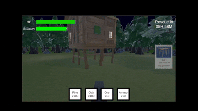
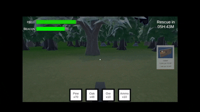
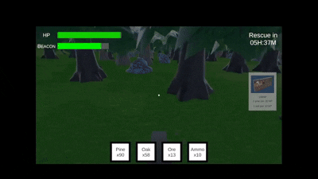

# Midnight Math Game
Midnight Math, created using Unity and C#, is an educational survival game designed for upper primary students (Primary 4 to 6) to enhance their mathematical proficiency through immersive First-Person, high-stakes gameplay. Players take on the role of a soldier stranded in a forest after a mission goes awry, tasked with maintaining an emergency signal beacon until an airlift rescue arrives at dawn. 

## Overview
The core gameplay revolves around resource management, environmental fortification, and combat, all of which are powered by solving mathematical problems. 
Key Gameplay Features: 
- Time-Pressure Survival: Survive for six in-game hours (18 minutes of real-time)
- Resource Gathering: Mine trees and rocks to collect materials for construction
- Building & Fortification: Construct objects and barricades to hinder approaching enemies and reach objects
- Dynamic Combat: Defend the safehouse against enemies by solving equations on them

## Demos
Building  

Mining  

Ammo Collection  

Card Matching  

Shooting  

## Educational Objectives
The game integrates four main components, each corresponding to a specific topic in the MOE Primary 4 to 6 Mathematics syllabus: 
- Energy Generator: A card-matching game where players match equivalent fractions and decimals to restore the beacon's power (Primary 6: Fractions and Decimals).
- Ammo Boxes: To unlock essential ammunition, players must identify and input the missing number in a sequence (Primary 5: Number Patterns).
- Equation Combat: Players defeat enemies by applying the correct Order of Operations to equations appearing on enemy units (Primary 5: Operations).
- Rate-Based Construction: Building structures requires calculating material costs based on a specified ratio of health points to materials (Primary 4: Rates).

## Play The Game
You can play the game here: 
[Game](https://pravin006.github.io/Midnight-Math-Game/)